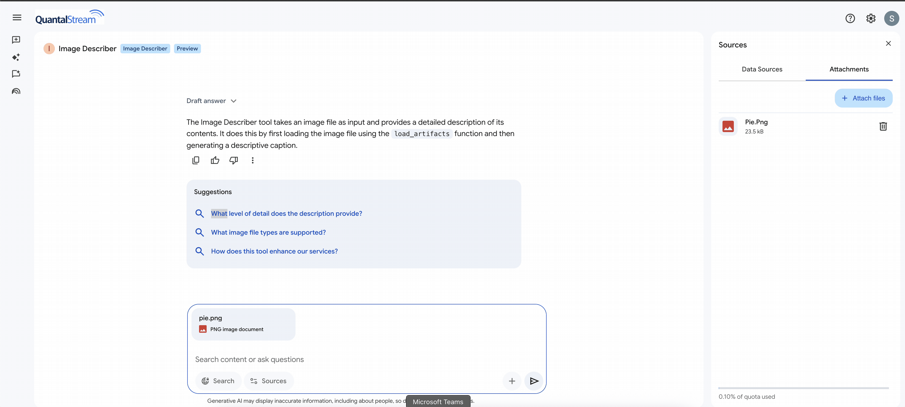

## Step 1 : Run the ADK Agent locally
```bash 
adk web
```
## Step 2 : Deploy ADK Agent to Agent Engine
```bash
python deploy-ae.py
```

## Step 3 : Register agent in Agentspace

```bash 
bash agentspace-register.sh

```